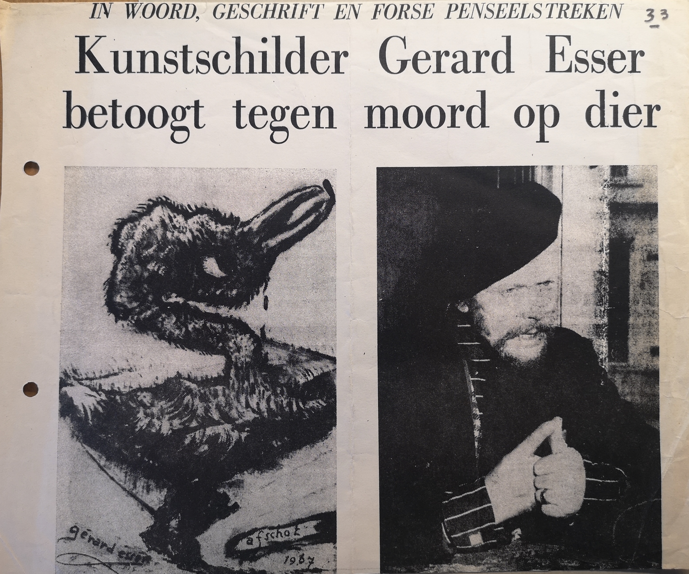
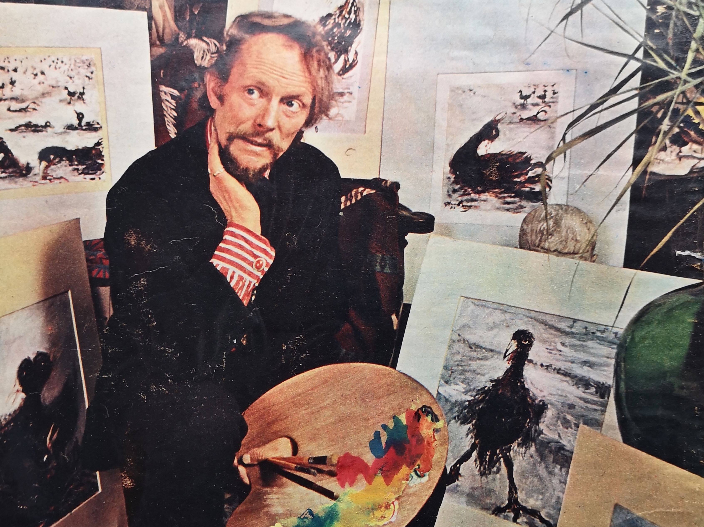
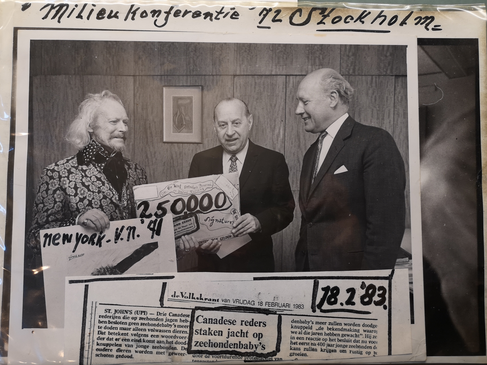
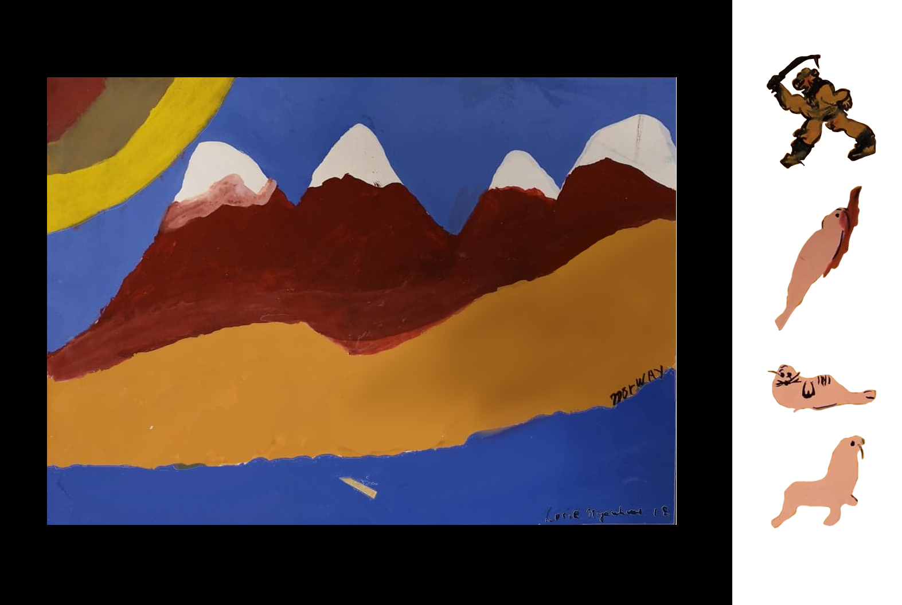
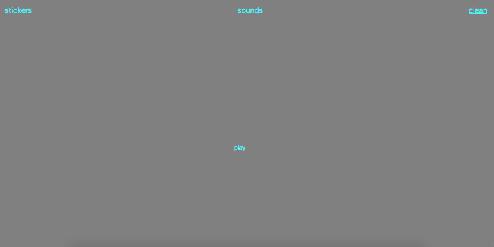
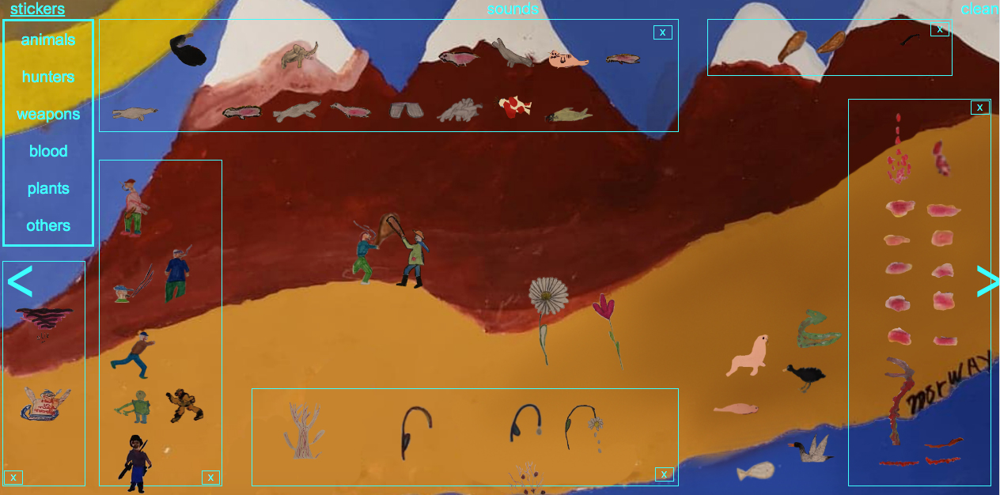
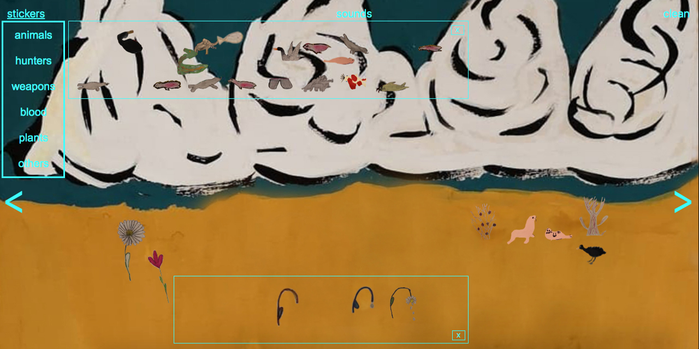
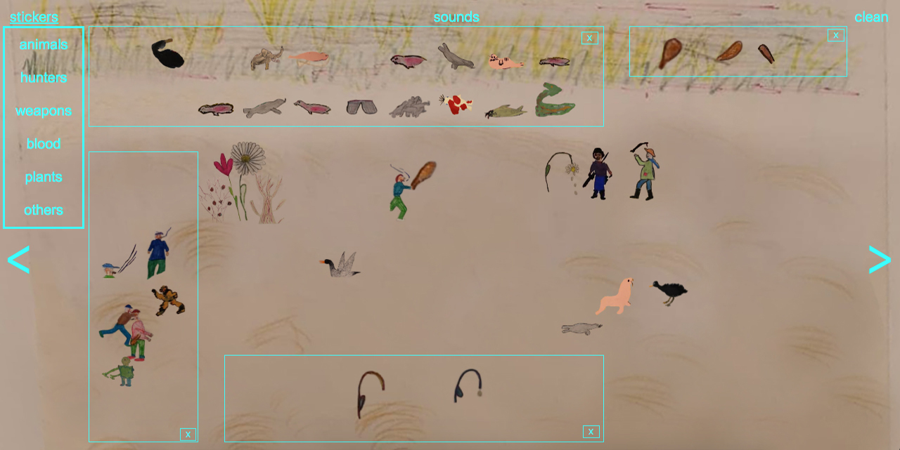

# Animal Rights For Future Generations

### Table of Contents
1. [Artefact](#artefact)
    1. [Metadata](#metadata)
2. [Research](#research)
    1. [Gerard Esser](#gerard-esser)
    2. [Gerard Esser Collectie at the IISH](#gerard-esser-collectie-at-the-IISH)
    3. [Content of the box](#content-of-the-box)
    4. [My Research Questions](#my-research-questions)
3. [Transcoding](#transcoding)
    1. [Transcoding 1](#transcoding-1)
    2. [Transcoding Tool](#transcoding-tool)
4. [Reflection](#reflection)
5. [Outcome](#outcome)
6. [Conclusion](#conclusion)
7. [Bibliography](#bibliography)

## Artefact
Box full of children's drawings on animal rights that belonged to Dutch artist, environmentalist and animal rights activist, Gerard Esser.     

### Metadata
| Tag | Data |  
|--|--|
**IISG Call Number** | [IISG BG X1/12](https://search.iisg.amsterdam/Record/1070791)
| **Physical Description** | Wooden Box
| **Type** | Object
| **Medium** | Box
| **Materials** | Wood
| **Date** | 1971
|| Rectangular and flat wooden box, 80x65x25 cm, customized by Gerard Esser. It is painted in white and it has a handwritten text which says " International Ecological Congress at Stockholm" in black and the letters "SOS" in a larger size in red. Each word is placed playfully all over the top of the box. On the few gaps available, there are two pictures of Gerard Esser from a magazine and some other small details like two stamps, a flat metal figure and some stickers.  The box opens as if we were dealing with a suitcase without wheels from that time. On the aperture side there is a rope that goes from the left side to the right side and works as a strap to make the carrying of the box easier. From the rope hang some laminated small papers with information about the artist and the congress he dedicated this box to.

## Research

### Gerard Esser

Gerard Johan Lodewijk Esser, was a Dutch artist, environmentalist and animal rights activist born in Amsterdam on February 15th 1908. He spent most of his life defending animal rights, especially  baby seals from being hunted for their fur in Canada. Later on, Greenpeace would take the quest.  He was also very active in the Provo movement, which was a Dutch counterculture movement in the mid-1960s that focused on provoking violent responses from authorities using non-violent bait.

### The *Gerard Esser Collectie* at the IISH

This collection consisted in 2,5m worth of folders with all the archive that Gerard Esser himself donated to the Institute in several occasions. The collection included a large amount of newspapers articles where Esser was featured as an artist and as an activist, portraits, pictures of his paintings, his testament, notebooks, folders with all the writings and flyers of the Provo movement, newspapers articles about the hunting of baby seals, pictures of several demonstrations that took place in Amsterdam, letters, poems and manifestos.
In 1972 Esser attended the UN International Ecological Congress in Stockholm and handed out to the secretary general, Maurice Strong, the half a million signatures he had collected from Dutch and Flemish school kids the last two years. He also organized a small exhibition of children's drawings in Stockholm, depicting pollution from children's eyes. With this he wanted to travel through all countries "to bring this accusation to the elderly". As an artist he portrays animals in nature.

### Content of the box

A collection of Dutch children's protest drawings with animal rights as main topic. All the drawings have the name and the last name of the maker and the age and they were made with colored pencils or acrylic paint.

### My research questions
* How to continue the legacy of Gerard Esser?
* How can I reach society?
* What audience do I want to reach?
* How do I teach this audience?
* What do I want to bring back to society?

## Transcoding

I wanted to use the drawings as a tool to teach children about animal rights. From children from the 70s to children from nowadays. Drawings brought back 50 years later to continue the fight for animal rights.

### Transcoding 1

**Description**

Detailed audio descriptions of the actions happening in the drawings.

**Aim**

Describing the drawings in audio files will give the chance to really understand the cruelty of the actions in the drawings without being distracted by the colorful children's drawings.

**Goal**

Reach people's sensitivity and make them more aware of this issue that, even though it's been 50 years since Esser's personal fight, there is still a long way to go.

**Methods**

Written description of the drawings and recording of the description with a phone.

**Written descriptions**

* **Drawing 1:**
*Four seals. One man. One stick. Eight blood stains. Stop this! Stop!*

* **Drawing 2:**
*Thee seals. One looks up. Another one is unaware. The other one is dead, lying on her own blood. By her body, an armed hunter.*

* **Drawing 3:**
*Big mountains. A free elephant. Let these animals live!*

* **Drawing 4:**
*Ice, ice and ice. A lonely seal covered by blood. A man standing and looking. He holds a weapon.*

* **Drawing 5:**
*Red and more red. A dead seal under it.*

* **Drawing 6:**
*Five armed men, four of them are smoking, two of them are using their weapons, one of them is pulling from the tail of a seal. Two of the men have a seal by their feet. Ten seals, six of them are piled up on top of each other. Two of them are by the feet of their murderer. One of them is being pulled by the tail. One of the men is looking. A person on the side screams "This is not necessary!".*

* **Drawing 7:**
*The water is dirty, dead fish in the river. Sad flowers, dying, losing their petals. Some flowers are already gone. There is no life. Some words that protest: "The air pollution ruins everything! The water is dirty. Bah!".*

* **Drawing 8:**
*There is a man, there is an animal. The man's arms are reaching the animal. The animal is covered by blood.*

* **Drawing 9:**
*A black bird in the background laying on the ground, the bird is hurting. A big black bird on the foreground. Red is coming out of their beaks. The white is tainted with blood.*

* **Drawing 10:**
*A duck tries to swim in the water. The wings are up, the beak is open. A feeling of desperation. In the blue water there is a substance, it's black. It's oil.*

**Audio files**

* [Audio files](https://soundcloud.com/kiliams)

## Transcoding Tool

**Description**

A drawing tool that can be used to recreate the drawings or create new ones, using the different landscapes and elements from the original drawings.

**Aim**

To teach what's good and what's wrong when dealing with animals.

**Goal**

When making a drawing one tends to make something cheerful or funny. By giving the option of choosing elements related to cruelty the creator will realize that those actions are indeed unacceptable.

**Sketch test**

**Methods**

Html/Css/Js languages for the website.

## Result

A website where the visitor can create new scenarios from the children's drawings with all the different landscapes and elements while listening to the audio description of those drawings in the background.

## Reflection

I have thought of thousand possible ways to continue Gerard Esser's legacy or at least to bring his actions back to life. He had done such an amazing work to protect the most vulnerable that I felt I had to support his cause. After going from one idea to another, I decided to make an interactive website. Although there were several difficulties on the way, I managed to make something very close to what I had in mind.

## Outcome

[Website](https://raw.githubusercontent.com/kiliarobus/Gerard-Esser/thepainofothers-master/index.html)

## Conclusion

With this project I tried to keep Gerard Esser's activism alive and hopefully my website will, at least, make a small impact on the young generations so that they grow understanding that animals also have rights and that they should be protected and respected.
