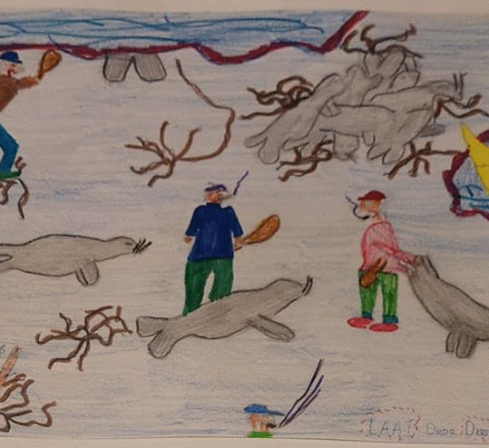
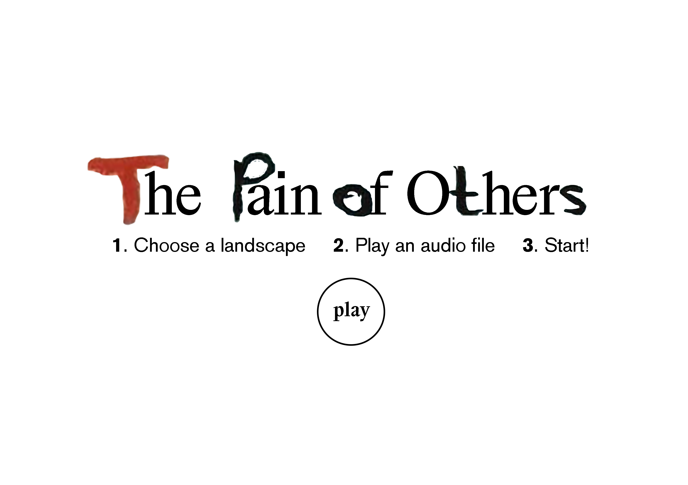
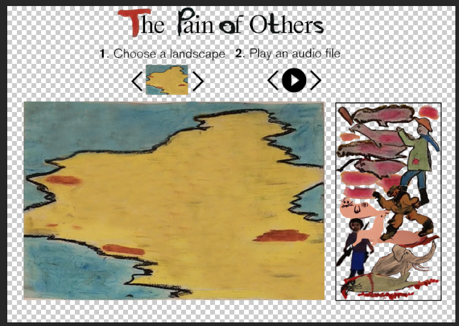

# Animal Rights For Future Generations

### Table of Contents
1. [Artefact](#artefact)
    1. [Metadata](#metadata)
2. [Research](#research)
    1. [Gerard Esser](#gerard-esser)
    2. [Gerard Esser Collectie at the IISH](#gerard-esser-collectie-at-the-IISH)
    3. [Content of the box] (#content-of-the-box)
    4. [My Research Questions](#my-research-questions)
3. [Transcoding](#transcoding)
    1. [Transcoding 1](#transcoding-1)
    2. [Transcoding Tool](#transcoding-tool)
4. [Reflection](#reflection)
5. [Outcome](#outcome)
6. [Conclusion](#conclusion)
7. [Bibliography](#bibliography)

## Artefact
Box full of children's drawings on animal rights that belonged to Dutch artist, environmentalist and animal rights activist, Gerard Esser.     

### Metadata
| Tag | Data |  
|--|--|
**IISG Call Number** | [IISG BG X1/12](https://search.iisg.amsterdam/Record/1070791)
| **Physical Description** | Wooden Box
| **Type** | Object
| **Medium** | Box
| **Materials** | Wood
| **Date** | 1971
|| Rectangular and flat wooden box, 80x65x25 cm, customized by Gerard Esser. It is painted in white and it has a handwritten text which says " International Ecological Congress at Stockholm" in black and the letters "SOS" in a larger size in red. Each word is placed playfully all over the top of the box. On the few gaps available, there are two pictures of Gerard Esser from a magazine and some other small details like two stamps, a flat metal figure and some stickers.  The box opens as if we were dealing with a suitcase without wheels from that time. On the aperture side there is a rope that goes from the left side to the right side and works as a strap to make the carrying of the box easier. From the rope hang some laminated small papers with information about the artist and the congress he dedicated this box to.

## Research

###Gerard Esser

Gerard Johan Lodewijk Esser, was a Dutch artist, environmentalist and animal rights activist born in Amsterdam on February 15th 1908. He spent most of his life defending animal rights, especially  baby seals from being hunted for their fur in Canada. Later on, Greenpeace would take the quest.  He was also very active in the Provo movement, which was a Dutch counterculture movement in the mid-1960s that focused on provoking violent responses from authorities using non-violent bait.

### Gerard Esser Collectie at the IISH

This collection consisted in 2,5m worth of folders with all the archive that Gerard Esser himself donated to the Institute in several occasions. The collection included a large amount of newspapers articles where Esser was featured as an artist and as an activist, portraits, pictures of his paintings, his testament, notebooks, folders with all the writings and flyers of the Provo movement, newspapers articles about the hunting of baby seals, pictures of several demonstrations that took place in Amsterdam, letters, poems and manifestos.
In 1972 Esser attended the UN International Ecological Congress in Stockholm and handed out to the secretary general, Maurice Strong, the half a million signatures he had collected from Dutch and Flemish school kids the last two years. He also organized a small exhibition of children's drawings in Stockholm, depicting pollution from children's eyes. With this he wanted to travel through all countries "to bring this accusation to the elderly". As an artist he portrays animals in nature.

### Content of the box

A stack of children's protest drawings with animal rights as main topic.

### My Research Questions
* How to continue the legacy of Gerard Esser?
* How to teach society about animal rights?
* What audience do I want to reach?
* What do I want to bring back to society?

## Transcoding

I wanted to use the drawings as a tool to teach children about animal rights. From children from the 70s to children from nowadays. Drawings brought back 50 years later to keep on fighting on a, still, very current issue.

### Transcoding 1

**Description**

Detailed written and audio descriptions of the actions happening in the drawings. Combining them with music made with each drawing using a website platform that turns drawings/images into music.

* **Aim**

Describing the drawings in audio files will give the chance to really understand the cruelty of the actions in the drawings without being distracted by the colorful children's drawings.

* **Goal**

Reach people's sensitivity and make them more aware of this issue that, even though it's been 50 years since Esser's personal fight, there is still a long way to go.

#### Methods

* I used my phone to record the description of the drawings.
* I used this website to get a sound/music from the drawings: http://www.imaginarysoundscape.net/#/upload

### Try outs

**Drawings**

**WRITTEN DESCRIPTIONS**

**Drawing 1:**
*Five armed men, four of them are smoking, two of them are using their weapons, one of them is pulling from the tail of a seal. Two of the men have a seal by their feet. Ten seals, six of them are piled up on top of each other. Two of them are by the feet of their murderer. One of them is being pulled by the tail. One of the men is looking. A person on the side screams "This is not necessary!".*

**Drawing 2:**
*The water is dirty, dead fish in the river. Sad flowers, dying, losing their petals. Some flowers are already gone. There is no life. Some words that protest: "The air pollution ruins everything! The water is dirty. Bah!".*

**Drawing 3:**
*There is a man, there is an animal. The man's arms are reaching the animal. The animal is covered by blood.*

**Drawing 4:**
*A black bird in the background laying on the ground, the bird is hurting. A big black bird on the foreground. Red is coming out of their beaks. The white is tainted with blood.*

**Drawing 5:**
*A duck tries to swim in the water. The wings are up, the beak is open. A feeling of desperation. In the blue water there is a substance, it's black. It's oil.*

**Drawing 6:**
*A mom rabbit, two baby rabbits, one on each side of her. They are eating a green leaf. "Let us live!", "May we also live?", "Protest against death!".*

**AUDIO FILES**

(audio files here)

**MUSIC FILES**

(audio files here)

## Transcoding Tool

## **Idea 1**

### Description
Website with the option of making your own drawings using the original drawings from the box. There are different landscapes that you can choose and a toolbox with all the elements that you can use to create the drawing.  
Once the drawing is done you'll be able to save it and make a new one.

Considering the idea of making the same kind of website but when using elements from the toolbox like "weapons", "hunters" or "blood", the drawing would be categorized as Wrong or Not Ok.

* Aim
To teach what's good and what's wrong when dealing with animals.

* Goal
When making a drawing the tendency is to make something happy, sweet or harmless. By giving the option of choosing elements related to cruelty the "artist" will realize that those actions are indeed unacceptable.

### Sketches
I first considered two options:

* Fill In The Gaps

* "Stick and Stack" (sticker album to create your own scenario)

## **Idea 2**

### Description
Website with audio recordings of detailed explanation of the drawings. The visitor will be given several landscapes and a toolbox and will be requested to make a drawing based on what they hear in the audio files.   
Once the drawing is done you'll be able to compare it to the original and if wished, save it and make a new one.

* Aim
The visitor will be in charge of visualizing the cruel actions that the children have depicted in their drawings. When one has to commit those actions the impact is higher.

* Goal
When making a drawing the tendency is to make something happy, sweet or harmless. By giving the option of choosing elements related to cruelty the "artist" will realize that those actions are indeed unacceptable.

### Sketches

* Website

### Methods
Html/Css languages for a website.

### Results
Website with drawing tool.

### Source Links

* https://jqueryui.com/draggable/

# Outcomes

* Still to be figured out.
* Link to the website when this is finished.

### Outcome Links

<a name="footnote-1">**[1]**</a>: Look at this little referenced footnote over here. You can look up different text formats for referencing books, online articles, films etc.
