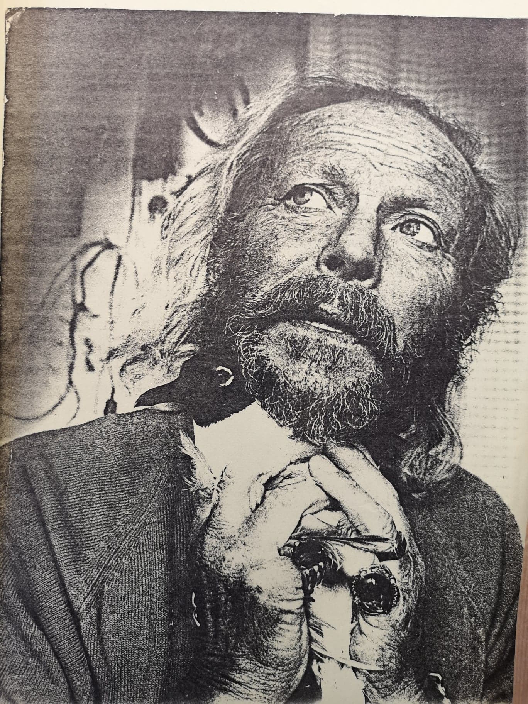

# TITLE HERE Example README.md Outline

### Table of Contents
1. [Artefact](#Artefact)
    1. [Metadata](#Metadata)
2. [Research](#Research-h1)
3. [Transcoding](#Transcoding)
    1. [Transcoding No. 1](#Transcoding-no-1)
    2. [Transcoding Tool](#Transcoding-tool)
4. [Reflection](#Reflection)
5. [Outcome](#Outcome)
# ANIMAL RIGHTS FOR THE FUTURE GENERATIONS

### Table of Contents
1. [Artefact](#Artefact)
    1. [Metadata](#Metadata)
2. [Research](#Research-h1)
3. [Transcoding](#Transcoding)
    1. [Transcoding No. 1](#Transcoding-no-1)
    2. [Transcoding Tool](#Transcoding-tool)
4. [Reflection](#Reflection)
5. [Outcome](#Outcome)
6. [Conclusion](#Conclusion)
7. [Bibliography](#Bibliography)

# Artefact
Box full of children's drawings on animal rights that belonged to Dutch artist, environmentalist and animal rights activist, Gerard Esser.     

## Metadata
| Tag | Data |  
|--|--|
**IISG Call Number** | [IISG BG X1/12](https://search.iisg.amsterdam/Record/1070791)
| **Physical Description** | Wooden Box
| **Type** | Object
| **Medium** | Box
| **Materials** | Wood
| **Date** | 1971
|| Rectangular and flat wooden box, 80x65x25 cm, customized by Gerard Esser. It is painted in white and it has a handwritten text which says " International Ecological Congress at Stockholm" in black and the letters "SOS" in a larger size in red. Each word is placed playfully all over the top of the box. On the few gaps available, there are two pictures of Gerard Esser from a magazine and some other small details like two stamps, a flat metal figure and some stickers.  The box opens as if we were dealing with a suitcase without wheels from that time. On the aperture side there is a rope that goes from the left side to the right side and works as a strap to make the carrying of the box easier. From the rope hang some laminated small papers with information about the artist and the congress he dedicated this box to.

# Gerard Esser

Gerard Johan Lodewijk Esser, was a Dutch artist, environmentalist and animal rights activist born in Amsterdam on February 15th 1908. He strongly defended baby seals from being hunted for their fur in Canada. Later on, Greenpeace would take the quest.  He was also very active in the Provo movement.

## Gerard Esser Collectie at the IISH
This collection consisted in 2,5m worth of folders with all the archive that Gerard Esser himself donated to the Institute in several occasions. The collection included a large amount of newspapers articles where Esser was featured as an artist and as an activist, portraits, pictures of his paintings, his testament, notebooks, folders with all the writings and flyers of the Provo movement, newspapers articles about the hunting of baby seals, pictures of several demonstrations that took place in Amsterdam, letters, poems and manifestos.
In 1972 Esser attended the UN International Ecological Congress in Stockholm and handed out to the secretary general, Maurice Strong, the half a million signatures he had collected from Dutch and Flemish school kids the last two years. He also organized a small exhibition of children's drawings in Stockholm, depicting pollution from children's eyes. With this he wanted to travel through all countries "to bring this accusation to the elderly". As an artist he portrays animals in nature.

### My Research Questions
* How to continue the legacy of Gerard Esser?
* How to teach society about animal rights?
* What audience do I want to reach?
* What do I want to bring back to society?

# Transcoding

In my research I could learn a lot about this specific character that Gerard Esser was. While going through all his documents I could create, what I believe, a clear idea of what kind of person he was. In one way or another I felt the urge to honor his person and the energy he spent on protecting animals.
Please include a general description of the role of transcoding in your project. Using the H2 headings below, you can specify individual Transcoding experiments. Think about your motivations in transcoding, and mention the role of tools (also those made during the assignment). This gives some direction to the reader about what they will read in more detail below.

## Transcoding No. 1
### Description
Short description here. You can structure the information and documentation for each transcoding, design research or coding tool as you like. It's important that you make clear the aims & goals of the transcoding, what methods and tools you use. If this is often the same across different transcodings, consider making a standardised table at the beginning of each.

You should include well-formatted documentation of your experiments and developments below. Someone without previous knowledge about your work should be able to follow along the steps, aims and results of your developments from this structure. Make sure all media used is correctly linked or embedded (images, PDFs, Videos, etc).

### Methods
Description of your methods, documentation of behind-the-scenes processes can go here. Think of the photos and videos you made when visiting the IISG or during captures of your artefact. You can use tools such as [Gifs.com](https://gifs.com/) to generate moving-image thumbnail to link to short videos.Just enough to give a clear overview, before getting into details.  

With some HTML tags you can do simple styling in markdown, for example:

    <width="50%">

Remember to include the url link to jump to the full media, of course!

### Tools
Mention the tools that you used or made (if and when relevant).

### Results
Some of your transcoding experiments may have smaller outcome sketches like images or short video tests. They can go directly within this section. Or maybe this transcoding became a part of the final outcome format. When that is the case, you can simply include a [hyperlink](#) to the final outcomes in the **Transcoding** section. In the final outcome section below you can embed or explain the final format outcome in detail.  

## Transcoding Tool
### Description
You might have made multiple coding tools during the semester. Or the transcoding tool might be part of a specific transcoding experiment itself. It's up to you to define the linear flow of the Readme. Just like the transcoding of media itself, the coding tool should be well documented. So if you are using a coding tool in your first experiment, include the documentation of the coding tool **before** you include the results, etc.

### Aims
Include the main aims or intentions behind making the tool, and what it is used for.

### Methods
This includes the coding languages, coding frameworks or libraries, and any platforms or webtools for example.   

### Results
The coding tool will vary a lot between different students. So depending on the use and type, you may include more or less documentation here.

### Source Links
Please include links to the tools, sources etc used during the coding. E.g. the resources used for making your coding tool.  

# Reflection
You might want to include a section about reflecting on the results of your coding and IMD experiments this semester. It can give additional context before reading the final outcomes below.

# Outcomes
This section will be different for each student, depending on how and what is formatted as a final result for the semester assignment. Nevertheless a clear written and documented outcomes is important. So give the appropriate subsections or formats to make this as thorough as possible.

### Outcome Links
Here you link to your final assignment outcomes. This could be a website, a video, etc etc. Please include links to the appropriate GitHub folder on your repository where your coding tool is stored.

This is the main way to access your IMD + Coding outcomes for the semester. So its very important that you check for bugs, troubleshoot hyperlink issues, embedded media issues etc. Please make sure you KNOW where each file you use is stored. E.g. If you migrated from Notion markdown into GitHub, its **VERY IMPORTANT** to know that Notion randomly stores images on an Amazon server. It changes those locations all the time. So if your main outcome or documentation is still grabbing those links, **its very likely** they might disappear before collectives. So please have all media and necessary files managed well in your own locations (online or github etc).   

# Conclusion
You might have a nice conclusive observation to share at the end :)

## Bibliography
Of course, as with all research work please include a good bibliography with links, and any references that were used or might give additional depth to the work.

<a name="footnote-1">**[1]**</a>: Look at this little referenced footnote over here. You can look up different text formats for referencing books, online articles, films etc.

6. [Conclusion](#Conclusion)
7. [Bibliography](#Bibliography)

# Artefact
You should include a short introduction about your artefact here. Keep in mind: there is space in the metadata (below) to include the 'formal' or 'physical' description. In your [Research](#Research-h1) section (even lower below) you can expand on the context, history and relevant information for the audience. This little introduction here should have a short, overview quality. Just enough to give a clear overview, before getting into details.  

## Metadata
| Tag | Data |  
|--|--|
**IISG Call Number** | [IISG BG K21/985](https://search.iisg.amsterdam/Record/1109411)
| **Physical Description** | Copper Bust
| **Type** | Object
| **Medium** | Sculpture
| **Materials** | Copper, Steel
| **Date** | 1912
|| This is literally a description of what you see in the image, make sure its a clear, complete and concise overview of the artefact. It should make sense for someone who doesn't see the image itself.  Our final *Catalogue of Resilience* might make use of one representative image from each student, so important to put your moneyshot here. You can build a gallery of additional artefact images below.

# Research (H1)

This section consolidates the background research, context and any relevant information regarding your research **into** the artefact.

## Research Sub-Heading (H2)
Its important to give a clear structure to your Readme. Please use the document structure provided by markdown, so think of Headings, Sub-headings, text, bold/italic, lists (bullets and numbered), tables etc. You can also include some linked footnotes like this. [[1]](#footnote-1)

### Research Sub-sub-heading (H3)
The H3 heading is useful to define specific subsections within the H2 section. If you are in doubt about information structure, take a look at different wikipedia articles for reference.

# Transcoding
Please include a general description of the role of transcoding in your project. Using the H2 headings below, you can specify individual Transcoding experiments. Think about your motivations in transcoding, and mention the role of tools (also those made during the assignment). This gives some direction to the reader about what they will read in more detail below.

## Transcoding No. 1
### Description
Short description here. You can structure the information and documentation for each transcoding, design research or coding tool as you like. It's important that you make clear the aims & goals of the transcoding, what methods and tools you use. If this is often the same across different transcodings, consider making a standardised table at the beginning of each.

You should include well-formatted documentation of your experiments and developments below. Someone without previous knowledge about your work should be able to follow along the steps, aims and results of your developments from this structure. Make sure all media used is correctly linked or embedded (images, PDFs, Videos, etc).

### Methods
Description of your methods, documentation of behind-the-scenes processes can go here. Think of the photos and videos you made when visiting the IISG or during captures of your artefact. You can use tools such as [Gifs.com](https://gifs.com/) to generate moving-image thumbnail to link to short videos.Just enough to give a clear overview, before getting into details.  

With some HTML tags you can do simple styling in markdown, for example:

    <width="50%">

Remember to include the url link to jump to the full media, of course!

### Tools
Mention the tools that you used or made (if and when relevant).

### Results
Some of your transcoding experiments may have smaller outcome sketches like images or short video tests. They can go directly within this section. Or maybe this transcoding became a part of the final outcome format. When that is the case, you can simply include a [hyperlink](#) to the final outcomes in the **Transcoding** section. In the final outcome section below you can embed or explain the final format outcome in detail.  

## Transcoding Tool
### Description
You might have made multiple coding tools during the semester. Or the transcoding tool might be part of a specific transcoding experiment itself. It's up to you to define the linear flow of the Readme. Just like the transcoding of media itself, the coding tool should be well documented. So if you are using a coding tool in your first experiment, include the documentation of the coding tool **before** you include the results, etc.

### Aims
Include the main aims or intentions behind making the tool, and what it is used for.

### Methods
This includes the coding languages, coding frameworks or libraries, and any platforms or webtools for example.   

### Results
The coding tool will vary a lot between different students. So depending on the use and type, you may include more or less documentation here.

### Source Links
Please include links to the tools, sources etc used during the coding. E.g. the resources used for making your coding tool.  

# Reflection
You might want to include a section about reflecting on the results of your coding and IMD experiments this semester. It can give additional context before reading the final outcomes below.

# Outcomes
This section will be different for each student, depending on how and what is formatted as a final result for the semester assignment. Nevertheless a clear written and documented outcomes is important. So give the appropriate subsections or formats to make this as thorough as possible.

### Outcome Links
Here you link to your final assignment outcomes. This could be a website, a video, etc etc. Please include links to the appropriate GitHub folder on your repository where your coding tool is stored.

This is the main way to access your IMD + Coding outcomes for the semester. So its very important that you check for bugs, troubleshoot hyperlink issues, embedded media issues etc. Please make sure you KNOW where each file you use is stored. E.g. If you migrated from Notion markdown into GitHub, its **VERY IMPORTANT** to know that Notion randomly stores images on an Amazon server. It changes those locations all the time. So if your main outcome or documentation is still grabbing those links, **its very likely** they might disappear before collectives. So please have all media and necessary files managed well in your own locations (online or github etc).   

# Conclusion
You might have a nice conclusive observation to share at the end :)

## Bibliography
Of course, as with all research work please include a good bibliography with links, and any references that were used or might give additional depth to the work.

<a name="footnote-1">**[1]**</a>: Look at this little referenced footnote over here. You can look up different text formats for referencing books, online articles, films etc.
