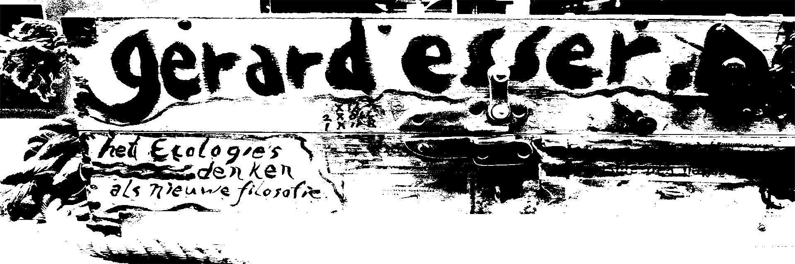
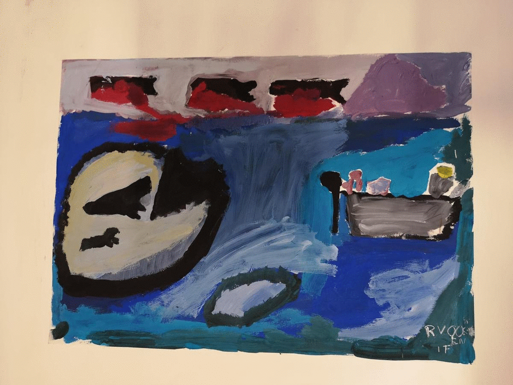
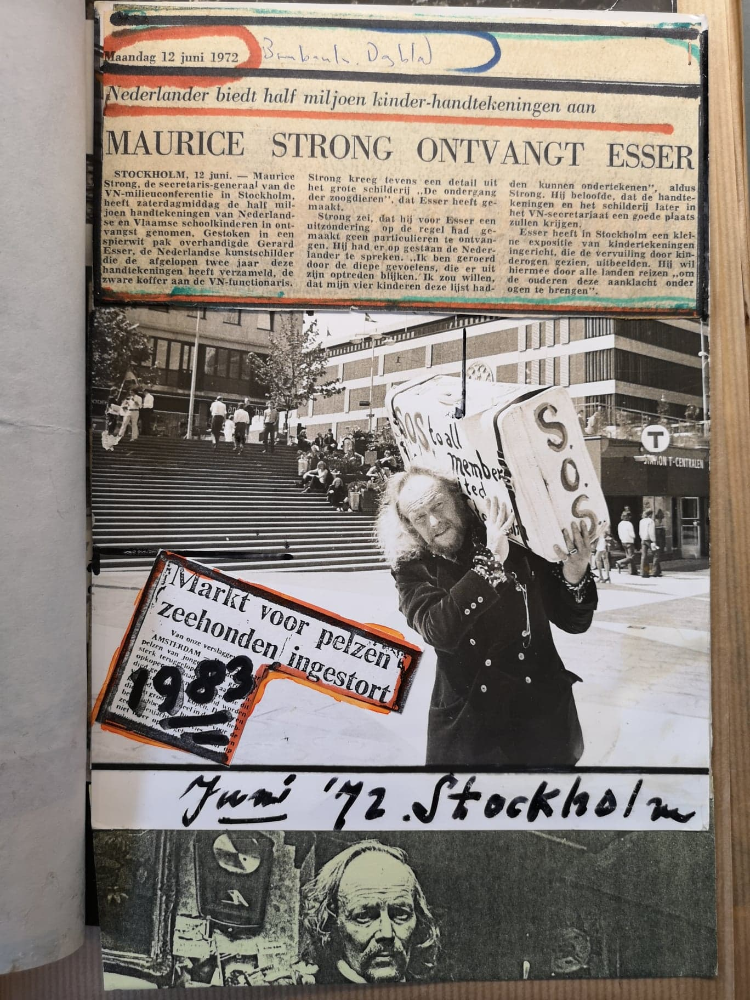
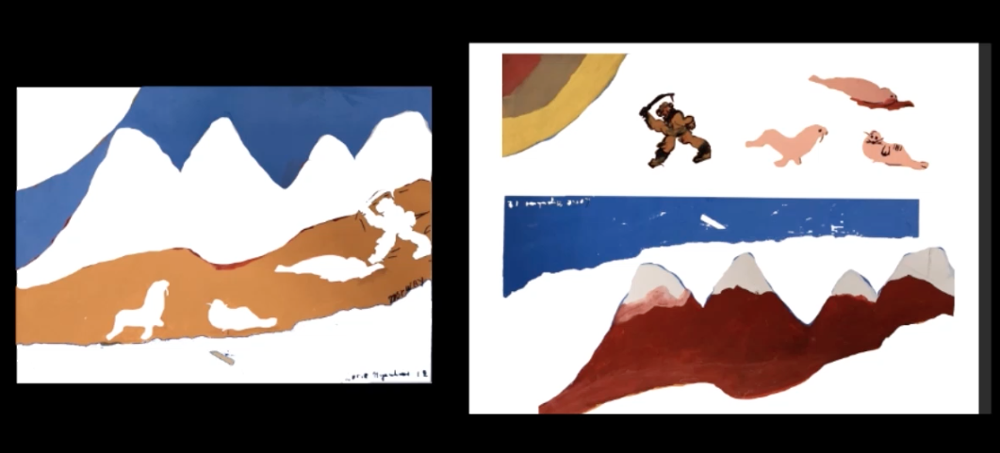

# ANIMAL RIGHTS FOR THE FUTURE GENERATIONS

### Table of Contents
1. [Artefact](#Artefact)
    1. [Metadata](#Metadata)
2. [Research](#Research-h1)
3. [Transcoding](#Transcoding)
    1. [Transcoding No. 1](#Transcoding-no-1)
    2. [Transcoding Tool](#Transcoding-tool)
4. [Reflection](#Reflection)
5. [Outcome](#Outcome)
6. [Conclusion](#Conclusion)
7. [Bibliography](#Bibliography)

# Artefact
Box full of children's drawings on animal rights that belonged to Dutch artist, environmentalist and animal rights activist, Gerard Esser.     

## Metadata
| Tag | Data |  
|--|--|
**IISG Call Number** | [IISG BG X1/12](https://search.iisg.amsterdam/Record/1070791)
| **Physical Description** | Wooden Box
| **Type** | Object
| **Medium** | Box
| **Materials** | Wood
| **Date** | 1971
|| Rectangular and flat wooden box, 80x65x25 cm, customized by Gerard Esser. It is painted in white and it has a handwritten text which says " International Ecological Congress at Stockholm" in black and the letters "SOS" in a larger size in red. Each word is placed playfully all over the top of the box. On the few gaps available, there are two pictures of Gerard Esser from a magazine and some other small details like two stamps, a flat metal figure and some stickers.  The box opens as if we were dealing with a suitcase without wheels from that time. On the aperture side there is a rope that goes from the left side to the right side and works as a strap to make the carrying of the box easier. From the rope hang some laminated small papers with information about the artist and the congress he dedicated this box to.

# CONTENT OF THE BOX

A stack of children's drawings dealing mostly with animal rights and the killing of baby seals.

## Gerard Esser

Gerard Johan Lodewijk Esser, was a Dutch artist, environmentalist and animal rights activist born in Amsterdam on February 15th 1908. He strongly defended baby seals from being hunted for their fur in Canada. Later on, Greenpeace would take the quest.  He was also very active in the Provo movement.

### Gerard Esser Collectie at the IISH
This collection consisted in 2,5m worth of folders with all the archive that Gerard Esser himself donated to the Institute in several occasions. The collection included a large amount of newspapers articles where Esser was featured as an artist and as an activist, portraits, pictures of his paintings, his testament, notebooks, folders with all the writings and flyers of the Provo movement, newspapers articles about the hunting of baby seals, pictures of several demonstrations that took place in Amsterdam, letters, poems and manifestos.
In 1972 Esser attended the UN International Ecological Congress in Stockholm and handed out to the secretary general, Maurice Strong, the half a million signatures he had collected from Dutch and Flemish school kids the last two years. He also organized a small exhibition of children's drawings in Stockholm, depicting pollution from children's eyes. With this he wanted to travel through all countries "to bring this accusation to the elderly". As an artist he portrays animals in nature.

### My Research Questions
* How to continue the legacy of Gerard Esser?
* How to teach society about animal rights?
* What audience do I want to reach?
* What do I want to bring back to society?

# Transcoding

I wanted to use the drawings as a tool to teach children about animal rights. From children from the 70s to children from nowadays. Drawings brought back 50 years later to keep on fighting on a, still, very current issue.

## Transcoding 1
### Description
Detailed description of the actions happening in the drawings. Combining them with music made with each drawing using a website platform that turns drawings/images into music.

* Aim
Describing the drawings in audio files will give the chance to really understand the cruelty of the actions in the drawings without being distracted by the colorful children's drawings.

* Goal
Reach people's sensitivity and make them more aware of this issue that, even though it's been 50 years since Esser's personal fight, there is still a long way to go.

### Methods
I used my phone to record the description of the drawings. To edit the sound I will use After Effects or a similar program.
Description of your methods, documentation of behind-the-scenes processes can go here. Think of the photos and videos you made when visiting the IISG or during captures of your artefact. You can use tools such as [Gifs.com](https://gifs.com/) to generate moving-image thumbnail to link to short videos.Just enough to give a clear overview, before getting into details.  

### Results
No final results yet.

## Transcoding Tool 2
### Description
Website with the option of making your own drawings using the original drawings from the box. There are different landscapes that you can choose and a toolbox with all the elements that you can use to create the drawing.  
Once the drawing is done you'll be able to save it and make a new one.

Considering the idea of making the same kind of website but when using elements from the toolbox like "weapons", "hunters" or "blood", the drawing would be categorized as Wrong or Not Ok.

* Aim
To teach what's good and what's wrong when dealing with animals.

* Goal
When making a drawing the tendency is to make something happy, sweet or harmless. By giving the option of choosing elements related to cruelty the "artist" will realize that those actions are indeed unacceptable.

### Sketches
I first considered two options:

* Fill In The Gaps

* "Stick and Stack" (sticker album to create your own scenario)

### Methods
Html/Css languages for a website.

### Results
Website with drawing tool.

### Source Links
Please include links to the tools, sources etc used during the coding. E.g. the resources used for making your coding tool.  

# Reflection
You might want to include a section about reflecting on the results of your coding and IMD experiments this semester. It can give additional context before reading the final outcomes below.

# Outcomes
This section will be different for each student, depending on how and what is formatted as a final result for the semester assignment. Nevertheless a clear written and documented outcomes is important. So give the appropriate subsections or formats to make this as thorough as possible.

### Outcome Links
Here you link to your final assignment outcomes. This could be a website, a video, etc etc. Please include links to the appropriate GitHub folder on your repository where your coding tool is stored.

This is the main way to access your IMD + Coding outcomes for the semester. So its very important that you check for bugs, troubleshoot hyperlink issues, embedded media issues etc. Please make sure you KNOW where each file you use is stored. E.g. If you migrated from Notion markdown into GitHub, its **VERY IMPORTANT** to know that Notion randomly stores images on an Amazon server. It changes those locations all the time. So if your main outcome or documentation is still grabbing those links, **its very likely** they might disappear before collectives. So please have all media and necessary files managed well in your own locations (online or github etc).   

# Conclusion
You might have a nice conclusive observation to share at the end :)

## Bibliography
Of course, as with all research work please include a good bibliography with links, and any references that were used or might give additional depth to the work.

<a name="footnote-1">**[1]**</a>: Look at this little referenced footnote over here. You can look up different text formats for referencing books, online articles, films etc.

6. [Conclusion](#Conclusion)
7. [Bibliography](#Bibliography)

<a name="footnote-1">**[1]**</a>: Look at this little referenced footnote over here. You can look up different text formats for referencing books, online articles, films etc.
